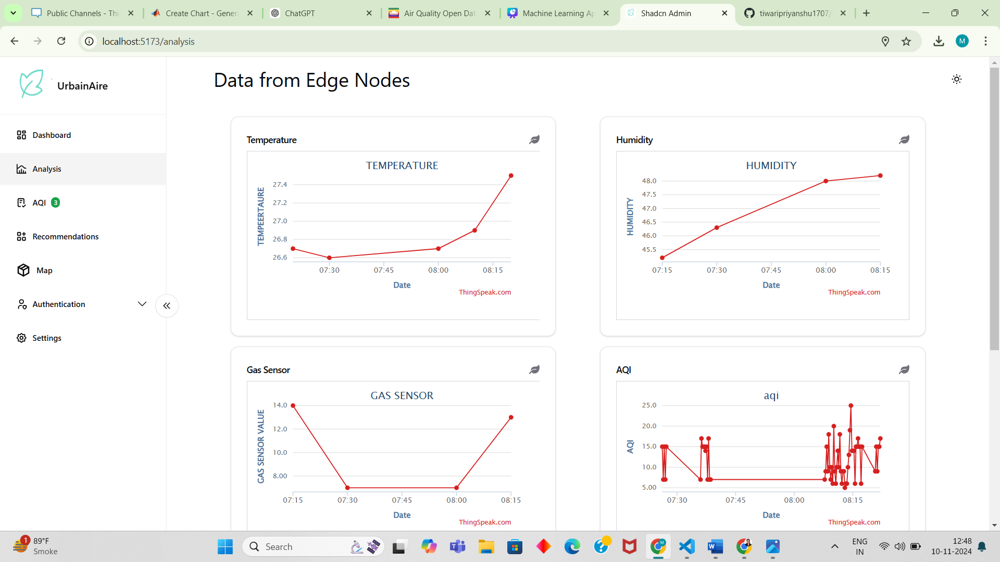
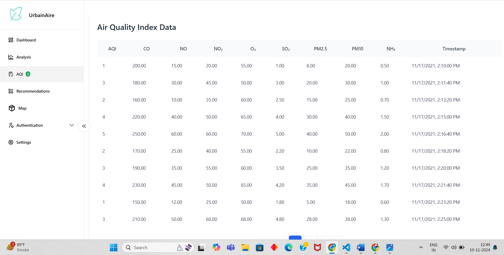
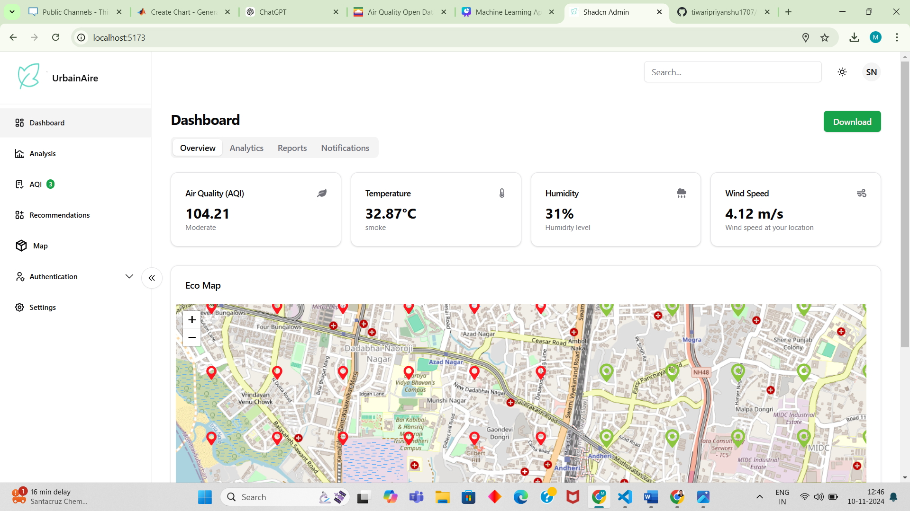
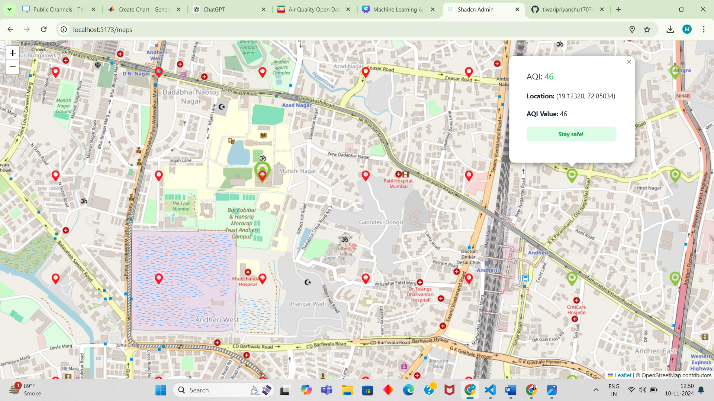
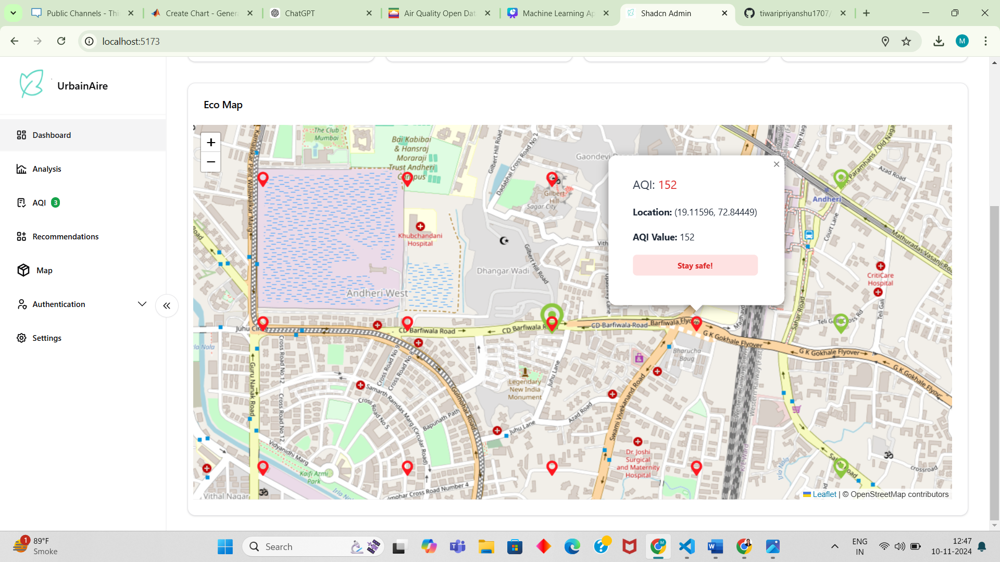
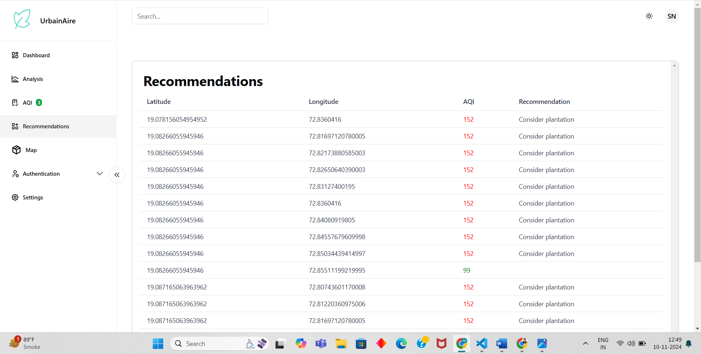
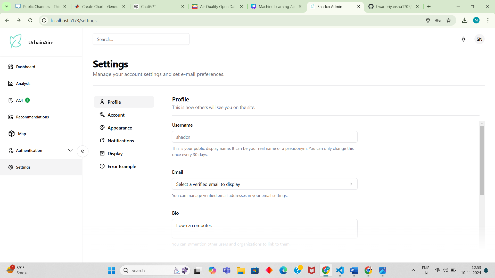
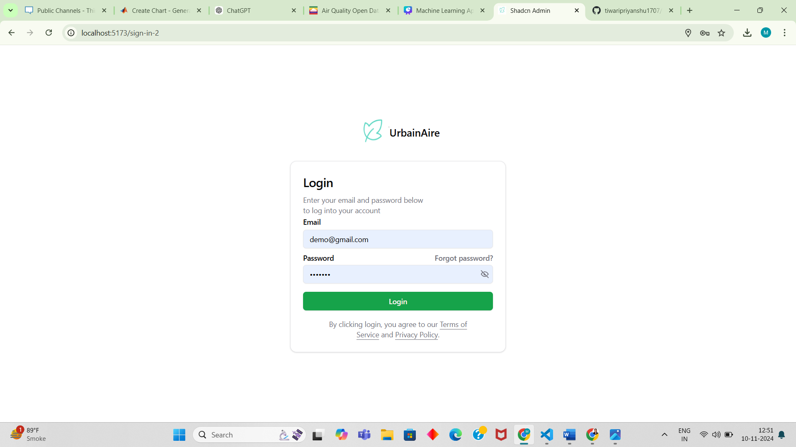
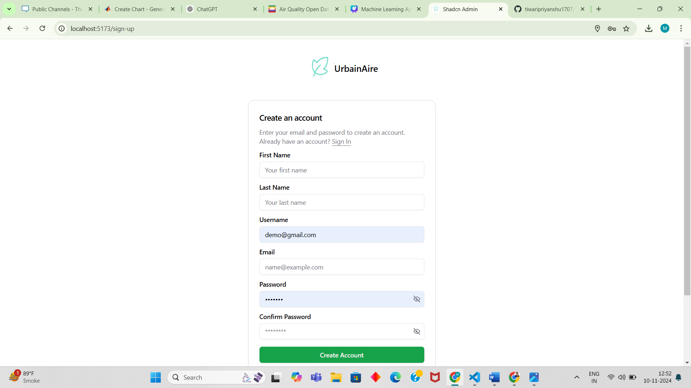
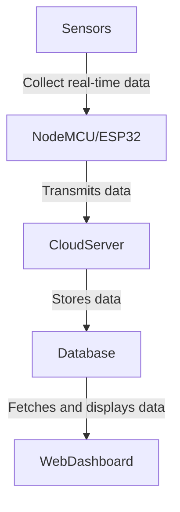

---

# **Air Quality Monitoring System**

## **Project Overview**
This project aims to build a **Real-Time Urban Air Quality Monitoring and Predictive Analytics System** to monitor air pollution levels in urban areas. By deploying **IoT-based sensors** to measure pollutants (PM2.5, PM10, CO2), the system provides insights into air quality, empowering individuals and communities to make informed health decisions. This scalable, affordable solution also aids policymakers in guiding pollution mitigation efforts.

---

## **Problem Statement**
Urban air pollution is a pressing environmental issue, impacting public health, quality of life, and the environment. Monitoring local air quality remains challenging due to the **high cost of equipment** and the **lack of real-time accessible data**. This project addresses these issues by creating a **scalable, affordable monitoring system** that provides accurate, timely data for residents and policymakers to respond effectively.

---
## **Dashboard Images**

### **1. Analysis**

### **2. Air Quality Index (AQI)**

### **3. Dashboard Working**

### **4. Full Map View**

### **5. Mini Map View**

### **6. Recommendations**

### **7. Settings**

### **8. Login Page**

### **9. Signup Page**

----

## **Solution Overview**
The **Air Quality Monitoring System** gathers real-time data on pollutants (PM2.5, PM10, CO2) and environmental factors (temperature, humidity) using IoT sensors. This data is transmitted to a **cloud-based platform** for processing and is visualized on a **web dashboard** for easy access and analysis.

---

## **Key Features**

- **Real-Time Monitoring**: Collects data on air quality and environmental factors in real time.
- **Data Visualization**: Displays pollution levels on a web dashboard for quick interpretation.
  
---

## **Solution Approach**

### **1. Hardware Components**

**Sensors**:
- **MQ-135**: Measures air quality (CO2, ammonia, benzene, etc.).
- **MQ-7**: Measures carbon monoxide (CO) levels.
- **PM2.5 & PM10 Sensor**: Detects particulate matter in the air.
- **DHT11/DHT22**: Measures temperature and humidity.

**Microcontroller**:
- **NodeMCU (ESP8266)** or **ESP32**: Microcontrollers with built-in Wi-Fi for IoT applications.

**Power Supply**:
- **5V USB Power Supply**: Powers the microcontroller and sensors.

**Breadboard & Connecting Wires**:
- **Jumper Wires**: For circuit connections between sensors and microcontroller.

---

### **2. Software Requirements**

- **Arduino IDE**: Used for microcontroller programming.
- **Backend Server & Database**: Firebase, AWS, or ThingSpeak for data collection and storage.
- **Web Dashboard**: HTML, CSS, JavaScript (using Chart.js or D3.js for visualization).
- **Data Analysis & Prediction** (optional): Python (Scikit-Learn) for machine learning.

---

### **3. System Architecture**

#### **Data Collection**
- **Sensors** collect data on pollutants and environment.
- Data read by **NodeMCU/ESP32** via analog/digital pins.

#### **Data Transmission**
- Microcontroller sends data to a **cloud server** over Wi-Fi at regular intervals.

#### **Data Processing & Storage**
- Cloud server processes and stores data in a **database**.

#### **Data Visualization**
- Web dashboard visualizes real-time and historical data.
- **Alert System** for pollutant levels exceeding safe thresholds.

#### **Predictive Analysis (Optional)**
- Machine learning model for air quality trends and predictions on dashboard.

---

### **4. Implementation Steps**

1. **Hardware Setup**:
   - Connect sensors to microcontroller using jumper wires on a breadboard.
2. **Programming the Microcontroller**:
   - Use Arduino IDE to read sensor data and transmit it to the cloud.
3. **Cloud Server Setup**:
   - Set up Firebase, AWS IoT, or ThingSpeak to receive and store data.
4. **Web Dashboard Development**:
   - Build a front-end with live data updates and graphical representations.
5. **Data Analysis & Prediction (Optional)**:
   - Use Python to train a model on historical data and integrate predictions.
6. **Testing & Calibration**:
   - Test in various environments to ensure data accuracy.
7. **Deployment & Documentation**:
   - Deploy the system, complete documentation, and provide setup instructions.

---

### **5. Cost-Effective Considerations**
- Use **low-cost sensors** (e.g., MQ series) for affordable data collection.
- Optimize **data transmission intervals** (e.g., every 10 seconds) to reduce bandwidth.

---

### **6. Tasks for Team Members**

**For Non-Technical Team Members (e.g., Siddhi)**:
- **Documentation**: Document steps for hardware setup, software configuration.
- **Presentation**: Design slides to explain problem, solution, and project impact.
- **UI Design Assistance**: Help design an appealing dashboard layout.

---

### **7. Sample Data Flow Diagram**

---

## **Future Improvements**

- **Advanced Sensors**: Upgrade to industrial-grade sensors for accuracy.
- **AI Integration**: Add machine learning insights to recommend low-pollution times.
- **Mobile Application**: Develop a mobile app for increased accessibility.

---

This project presents a **practical, affordable solution** to monitor urban air quality in real-time, benefiting residents, policymakers, and urban planners. By making air quality data accessible, we contribute to a healthier, more sustainable community.

--- 

### **License**
This project is licensed under the MIT License.

---

